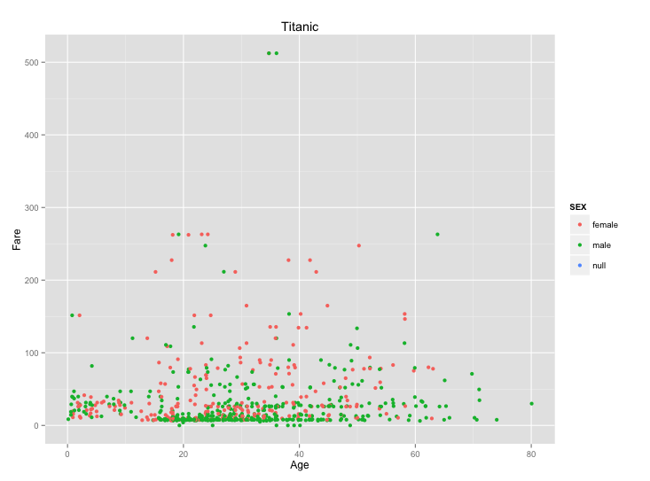
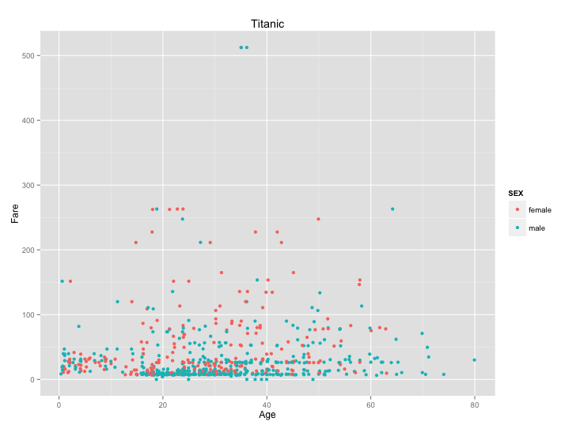
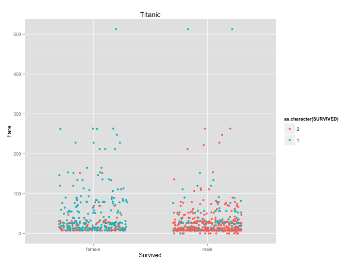
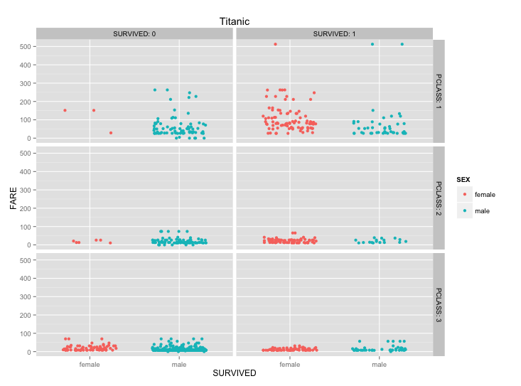
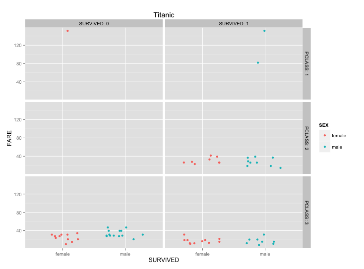
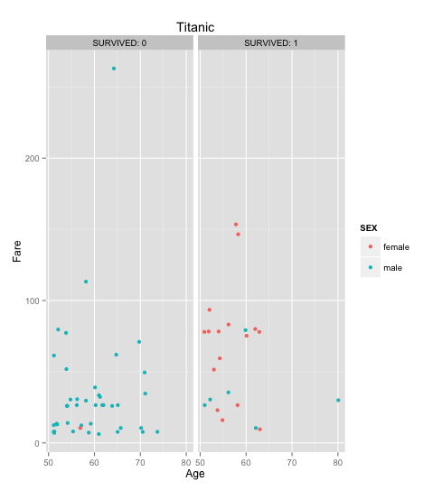

----------------


DV_RProject1
----------------

================

#Plot 1
```
#SQL: select * from titanic

#Plot:

ggplot() + 
  coord_cartesian() + 
  scale_x_continuous() +
  scale_y_continuous() +
  labs(title='Titanic') +
  labs(x="Age", y=paste("Fare")) +
  layer(data=df, 
        mapping=aes(x=as.numeric(as.character(AGE)), y=as.numeric(as.character(FARE)), color=SEX), 
        stat="identity", 
        stat_params=list(), 
        geom="point",
        geom_params=list(), 
        position=position_jitter(width=0.3, height=0)
  )
```  
  



#Plot 2  
```
#SQL: select * from titanic where sex is not null

#Plot:

ggplot() + 
  coord_cartesian() + 
  scale_x_continuous() +
  scale_y_continuous() +
  labs(title='Titanic') +
  labs(x="Age", y=paste("Fare")) +
  layer(data=df, 
        mapping=aes(x=as.numeric(as.character(AGE)), y=as.numeric(as.character(FARE)), color=SEX), 
        stat="identity", 
        stat_params=list(), 
        geom="point",
        geom_params=list(), 
        position=position_jitter(width=0.3, height=0)
  )
```  


#Plot 3
```
#SQL: select * from titanic where sex is not null

#Plot:

ggplot() + 
  coord_cartesian() + 
  scale_x_discrete() +
  scale_y_continuous() +
  labs(title='Titanic') +
  labs(x="Survived", y=paste("Fare")) +
  layer(data=df, 
        mapping=aes(x=SEX, y=as.numeric(as.character(FARE)), color=as.character(SURVIVED)), 
        stat="identity", 
        stat_params=list(), 
        geom="point",
        geom_params=list(), 
        position=position_jitter(width=0.3, height=0)
  )
```  


#Plot 4
```
#SQL: select * from titanic where sex is not null

#Plot:

ggplot() + 
  coord_cartesian() + 
  scale_x_discrete() +
  scale_y_continuous() +
  facet_grid(PCLASS~SURVIVED, labeller=label_both) +
  labs(title='Titanic') +
  labs(x="SURVIVED", y=paste("FARE")) +
  layer(data=df, 
        mapping=aes(x=SEX, y=as.numeric(as.character(FARE)), color=SEX), 
        stat="identity", 
        stat_params=list(), 
        geom="point",
        geom_params=list(), 
        position=position_jitter(width=0.3, height=0)
  )
```  


#Plot 5
```
#SQL: Select * from Titanic where sex is not null and age <=10

#Plot:

ggplot() + 
  coord_cartesian() + 
  scale_x_discrete() +
  scale_y_continuous() +
  facet_grid(PCLASS~SURVIVED, labeller=label_both) +
  labs(title='Titanic') +
  labs(x="SURVIVED", y=paste("FARE")) +
  layer(data=df, 
        mapping=aes(x=SEX, y=as.numeric(as.character(FARE)), color=SEX), 
        stat="identity", 
        stat_params=list(), 
        geom="point",
        geom_params=list(), 
        position=position_jitter(width=0.3, height=0)
  )
```


#Plot 6
```
#SQL: Where sex is not null and age > 50

#Plot:

ggplot() + 
  coord_cartesian() + 
  scale_x_continuous() +
  scale_y_continuous() +
  facet_grid(~SURVIVED,labeller=label_both) +
  labs(title='Titanic') +
  labs(x="Age", y=paste("Fare")) +
  layer(data=df, 
        mapping=aes(x=as.numeric(as.character(AGE)), y=as.numeric(as.character(FARE)), color=SEX), 
        stat="identity", 
        stat_params=list(), 
        geom="point",
        geom_params=list(), 
        position=position_jitter(width=0.3, height=0)
  )
  
```




=======

# Summary of Titanic Data
```
> summary(df)

PASSENGERID       SURVIVED          PCLASS                                         NAME    
 Min.   :  1.0   Min.   :0.0000   Min.   :1.000   Abbing, Mr. Anthony                  :  1  
 1st Qu.:223.5   1st Qu.:0.0000   1st Qu.:2.000   Abbott, Mr. Rossmore Edward          :  1  
 Median :446.0   Median :0.0000   Median :3.000   Abbott, Mrs. Stanton (Rosa Hunt)     :  1  
 Mean   :446.0   Mean   :0.3838   Mean   :2.309   Abelson, Mr. Samuel                  :  1  
 3rd Qu.:668.5   3rd Qu.:1.0000   3rd Qu.:3.000   Abelson, Mrs. Samuel (Hannah Wizosky):  1  
 Max.   :891.0   Max.   :1.0000   Max.   :3.000   Adahl, Mr. Mauritz Nils Martin       :  1  
                                                  (Other)                              :885  
     SEX           AGE          SIBSP           PARCH             TICKET         FARE       
 female:314   null   :177   Min.   :0.000   Min.   :0.0000   1601    :  7   Min.   :  0.00  
 male  :577   24     : 30   1st Qu.:0.000   1st Qu.:0.0000   347082  :  7   1st Qu.:  7.91  
              22     : 27   Median :0.000   Median :0.0000   CA. 2343:  7   Median : 14.45  
              18     : 26   Mean   :0.523   Mean   :0.3816   3101295 :  6   Mean   : 32.20  
              19     : 25   3rd Qu.:1.000   3rd Qu.:0.0000   347088  :  6   3rd Qu.: 31.00  
              28     : 25   Max.   :8.000   Max.   :6.0000   CA 2144 :  6   Max.   :512.33  
              (Other):581                                    (Other) :852                   
         CABIN     EMBARKED  
 null       :687   C   :168  
 B96 B98    :  4   null:  2  
 C23 C25 C27:  4   Q   : 77  
 G6         :  4   S   :644  
 C22 C26    :  3             
 D          :  3             
 (Other)    :186             

```
# Subset of Titanic Data

```
> tail(subset(df, select = c(FARE, SEX)))
 
        FARE    SEX
886  41.5792 female
887 153.4625 female
888  31.2750 female
889   7.0500   male
890  15.5000 female
891   7.7500   male

```
 
